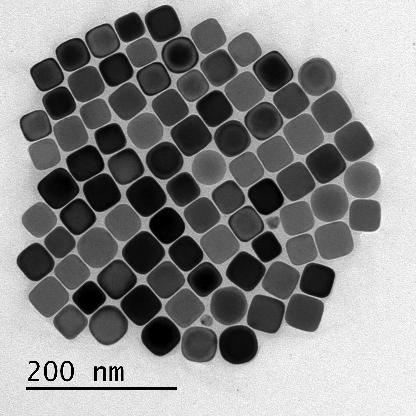

# Detection and classification of nanoshapes
The goal of this project is to detect and classify nanoshapes photographed with Transmission Electron Microscopy, to help scientists identify what has been synthesized in the lab. 

# Instructions
### Environment
To run the files in this project, it is recommended to make a clean python virtual environment, and then install the requirements.
This can be done by running
    python -m venv <yourVirtualEnv>
activating it with
    source <yourVirtualEnv>/bin/activate 
then running 
    pip install -r requirements.txt

### Training
To train a model, you need to select your venv as kernel for the notebook training.ipynb. 

The second cell contains some parameters you need to configure for your environment. Principally, **num_epochs** sets the number of epochs to train for, **root** is the directory your data folder is located in, and **model_savename** is the name your model will have. Be careful, if there is already a model with the same name, the notebook will overwrite it.

### Prediting
To use the model for predictions, your virtual environment needs to be active, and then you can run the predictions.py file.
There are some paramters to change here as well. The **root** folder is the directory in which the model is saved, the **Images** folder is located, and the directory in which the **PredImg** folder is located (If you save the predicted images). The **modelname** is the name of the saved model file, **classes** are the classes we are trying to predict (always with 'background' as the zeroth class).  
